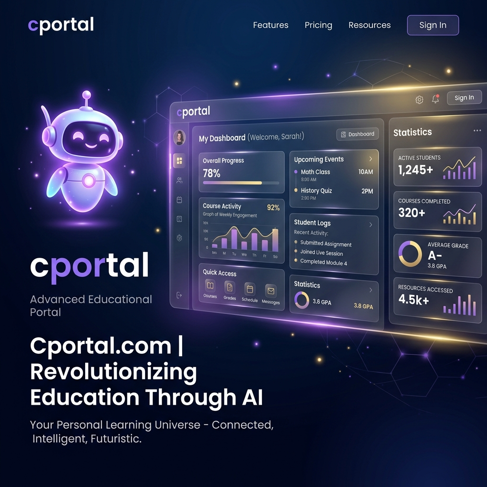

# cportal - Tswayi High School Portal

An elegant, high-performance, and lightweight school management system designed specifically for private secondary schools. **cportal** matches modern professional aesthetics while retaining standard, lightweight dependencies suited for educational institutions that need advanced administrative and student features.

This is a Web Development project developed by the **NUST Computer Science department (Mphathisi Ndlovu, Melissa Dube, Daphne Ncube)**.

---

## 🚀 Key Features

The portal implements **6 distinct roles** inside a single, unified database schema:

1. **Guest (Public Homepage)**
   * View upcoming academic events, calendars, and sports notices.
   * Access the floating **AI Assistant** for general course and enrollment inquiries.
   * Apply online for student enrollment.

2. **Student (Dashboard)**
   * View individual subject report cards and terminal grades.
   * Locked dashboard overlay if tuition fees are unpaid.
   * Interact with the personalized **AI Study Buddy** for homework help, averages, and feedback.

3. **Parent (Dashboard)**
   * Track enrollment application approvals (Pending/Approved/Rejected).
   * Retrieve generated student credentials (username and default password) once approved.

4. **Teacher (Dashboard)**
   * Manage assigned classes and class lists.
   * Input, save, and update student terminal marks/grades dynamically.

5. **Bursar (Dashboard)**
   * Manage student fee statuses (USD/ZiG cash register).
   * Toggle student paid status, instantly restricting or unlocking their grade dashboard.

6. **School Administrator (Dashboard)**
   * Hire teachers and assign subjects.
   * Configure academic classes and teacher allocations.
   * Approve/Reject parent enrollment applications and allocate classes.
   * Post upcoming academic events and announcements to the calendar.

7. **IT Helpdesk (Dashboard)**
   * Complete audit log checks with IP logs.
   * Lock/Unlock user accounts.
   * Force password resets.
   * Review and resolve support tickets.

---

## 🛠 Tech Stack

* **Frontend**: Vanilla HTML5, CSS3 (Premium dark-mode glassmorphic design system), Vanilla JavaScript (async AI chat, toggle interactions).
* **Backend**: PHP (Modular structured OOP PDO database controller).
* **Database**: MySQL (`project_db` schema).
* **AI Integration**: Groq Cloud AI APIs (`Llama-3.1-8B-Instant`) via PHP streaming wrapper (with built-in offline mock fallback support).

---

## ⚙️ Installation & Usage

For full details on setting up your local database, configuring environment variables, running the development server, and logging in with default pre-seeded credentials, see:

👉 **[setupsteps.md](setupsteps.md)**
